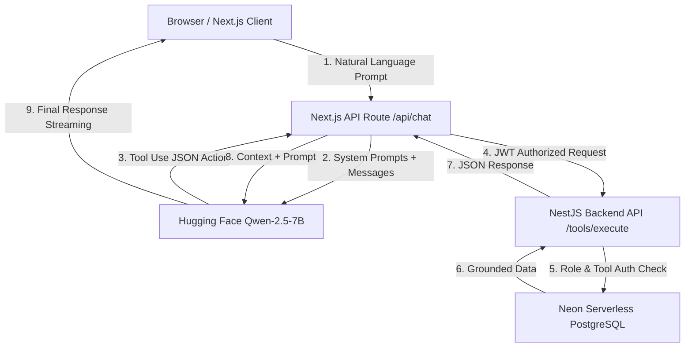

# EduNexus: AI-Agent Powered School Management SaaS

EduNexus is a production-ready, full-stack school management system featuring multi-role dashboards, live PostgreSQL database access, and a secure **Agentic AI Assistant** that operates via function calling (tool use) rather than static prompts or generic API wrappers.

[](https://nextjs.org/)
[](https://nestjs.com/)
[](https://www.prisma.io/)
[](https://neon.tech/)
[](https://huggingface.co/)
[](https://www.typescriptlang.org/)

---

## 🚀 Live Demo & Visuals

> 🔗 **Live URL:** [Insert your deployed Vercel URL here]  
> 📹 **Walkthrough Video:** [Link a 1-minute Loom demo showing login and AI tool calling]

### Screenshots
*Deploy the app and paste screenshots into `docs/screenshots/` to replace these placeholders.*
| Landing Page | Admin Dashboard | Agentic AI Assistant |
| :---: | :---: | :---: |
| _[Add landing.png]_ | _[Add admin-dashboard.png]_ | _[Add ai-chat.png]_ |

---

## 🔥 Portfolio Value: Why This Project Reaches the Top 5%

Most freelance developers show basic CRUD apps or simple "AI chatbot wrappers." EduNexus is designed to prove you can build **production-ready, secure, and smart SaaS products**.

### Key Differentiators:
1. **Agentic Tool Loop:** The AI doesn't hallucinate student records. It translates natural language into structured JSON actions, executes database queries via a NestJS API with Prisma, and synthesizes grounded answers based solely on live data.
2. **Strict Multi-Role Auth & RBAC:** Features four core roles:
   * **Admin:** Full school overview, financial metrics, student/teacher management, and AI fee reports.
   * **Teacher:** Attendance marking, grading, notices, and AI class queries.
   * **Student:** Personal grade cards, attendance analytics, and notice board.
   * **Parent:** Performance profiles, attendance logs, and fee payments for their linked children.
3. **Granular AI Security Guardrails:** Role-based access control (RBAC) extends directly to AI tools. Teachers cannot trigger student additions or view financial fee reports via AI commands.
4. **Performance Optimized:** Uses parallel queries, 60s memory caching for heavy admin stats, API request deduplication, and Server-Sent Events (SSE) for a fluid AI thinking/streaming experience.

---

## 🏗️ System Architecture



---

## 🛠️ Tech Stack & Key Modules

* **Frontend:** Next.js 14 (App Router), React 18, Tailwind CSS, Recharts for analytics.
* **Backend:** NestJS 11 (Modular, TypeScript), Prisma ORM.
* **Database:** Serverless PostgreSQL on Neon.
* **AI Engine:** Hugging Face Inference API (`Qwen2.5-7B-Instruct`).
* **Authentication:** JWT tokens stored in HTTP-only cookies and localStorage, secured with role-based Route Guards.
* **Reporting:** PDF fee statements generated client-side with `jsPDF`.

---

## 💻 Quick Start (Local Setup)

### Prerequisites
* Node.js v18 or higher
* PostgreSQL instance or a free account on [Neon.tech](https://neon.tech)
* A free [Hugging Face](https://huggingface.co) API Key

### 1. Backend Service
```bash
cd backend
cp .env.example .env
# Update .env with your DATABASE_URL and JWT_SECRET
npm install
npx prisma db push
npx prisma db seed
npx ts-node update-demo.ts
npm run start:dev
```
*Runs locally on [http://localhost:4000](http://localhost:4000)*

### 2. Frontend Web App
```bash
cd ../frontend
cp .env.example .env.local
# Update env variables:
# NEXT_PUBLIC_API_URL=http://127.0.0.1:4000
# JWT_SECRET=(Must match backend JWT_SECRET)
# HUGGINGFACE_API_KEY=hf_... (your hugging face token)
npm install
npm run dev
```
*Runs locally on [http://localhost:3000](http://localhost:3000)*

---

## 🌐 Free Production Deployment

We use 100% free hosting providers to publish this full-stack application online:

| Layer | Provider | Hosting Type | Link |
|---|---|---|---|
| **Database** | **Neon** | Serverless PostgreSQL | [neon.tech](https://neon.tech) |
| **Backend** | **Render** | Node.js Web Service | [render.com](https://render.com) |
| **Frontend** | **Vercel** | Next.js Serverless Platform | [vercel.com](https://vercel.com) |

> 📖 **Step-by-Step Instructions:** Follow the detailed [Free Deployment Guide](./docs/DEPLOYMENT-FREE.md) to set up your production database, deploy the API to Render, host the user interface on Vercel, and configure production environment variables.

---

## 📝 Demo Credentials (Seeded Data)

Log in using these pre-seeded accounts to experience role-specific dashboards:

| Role | Email | Password | Allowed AI Tools |
|---|---|---|---|
| **Admin** | `admin@edunexus.com` | `admin123` | All (fee reports, student creation, attendance) |
| **Teacher** | `teacher@edunexus.com` | `teacher123` | Class statistics, student profiles, attendance |
| **Student** | `student@edunexus.com` | `student123` | _None (Dashboard access only)_ |
| **Parent** | `parent@edunexus.com` | `parent123` | _None (Child portal view only)_ |

---

## 🔒 Security Policy
* Never commit `.env` or `.env.local` configuration files containing active database credentials or API keys.
* Ensure `HUGGINGFACE_API_KEY` is kept strictly server-side on Vercel and is not exposed with the `NEXT_PUBLIC_` prefix.

---

## 📄 License
This project is licensed under the MIT License. Use it to build your portfolio and show off your agentic AI skills!
