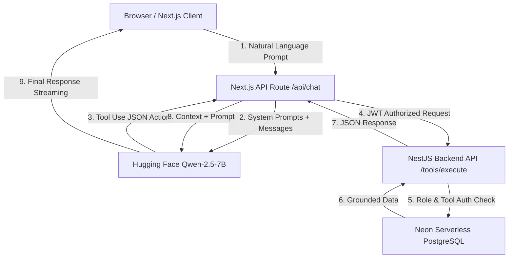

# EduNexus: AI-Agent Powered School Management SaaS

EduNexus is a production-ready, full-stack school management system featuring multi-role dashboards, live PostgreSQL database access, and a secure **Agentic AI Assistant** that operates via function calling (tool use) rather than static prompts or generic API wrappers.

[](https://nextjs.org/)
[](https://nestjs.com/)
[](https://www.prisma.io/)
[](https://neon.tech/)
[](https://huggingface.co/)
[](https://www.typescriptlang.org/)

---

## 🚀 Live Demo & Visuals

> 🔗 **Live URL:** [Insert your deployed Vercel URL here]  
> 📹 **Walkthrough Video:** [Link a 1-minute Loom demo showing login and AI tool calling]

### Screenshots
*Deploy the app and paste screenshots into `docs/screenshots/` to replace these placeholders.*
| Landing Page | Admin Dashboard | Agentic AI Assistant |
| :---: | :---: | :---: |
| _[Add landing.png]_ | _[Add admin-dashboard.png]_ | _[Add ai-chat.png]_ |

---

## 🔥 Portfolio Value: Why This Project Reaches the Top 5%

Most freelance developers show basic CRUD apps or simple "AI chatbot wrappers." EduNexus is designed to prove you can build **production-ready, secure, and smart SaaS products**.

### Key Differentiators:
1. **Agentic Tool Loop:** The AI doesn't hallucinate student records. It translates natural language into structured JSON actions, executes database queries via a NestJS API with Prisma, and synthesizes grounded answers based solely on live data.
2. **Strict Multi-Role Auth & RBAC:** Features four core roles:
   * **Admin:** Full school overview, financial metrics, student/teacher management, and AI fee reports.
   * **Teacher:** Attendance marking, grading, notices, and AI class queries.
   * **Student:** Personal grade cards, attendance analytics, and notice board.
   * **Parent:** Performance profiles, attendance logs, and fee payments for their linked children.
3. **Granular AI Security Guardrails:** Role-based access control (RBAC) extends directly to AI tools. Teachers cannot trigger student additions or view financial fee reports via AI commands.
4. **Performance Optimized:** Uses parallel queries, 60s memory caching for heavy admin stats, API request deduplication, and Server-Sent Events (SSE) for a fluid AI thinking/streaming experience.

---

## 🏗️ System Architecture



---

## 🛠️ Tech Stack & Key Modules

* **Frontend:** Next.js 14 (App Router), React 18, Tailwind CSS, Recharts for analytics.
* **Backend:** NestJS 11 (Modular, TypeScript), Prisma ORM.
* **Database:** Serverless PostgreSQL on Neon.
* **AI Engine:** Hugging Face Inference API (`Qwen2.5-7B-Instruct`).
* **Authentication:** JWT tokens stored in HTTP-only cookies and localStorage, secured with role-based Route Guards.
* **Reporting:** PDF fee statements generated client-side with `jsPDF`.

---

## 💻 Quick Start (Local Setup)

### Prerequisites
* Node.js v18 or higher
* PostgreSQL instance or a free account on [Neon.tech](https://neon.tech)
* A free [Hugging Face](https://huggingface.co) API Key

### 1. Backend Service
```bash
cd backend
cp .env.example .env
# Update .env with your DATABASE_URL, JWT_SECRET, and FRONTEND_URL
npm install
npx prisma generate
npx prisma db push
npx prisma db seed
npm run start:dev
```
*Runs locally on [http://localhost:4000](http://localhost:4000)*

### 2. Frontend Web App
```bash
cd frontend
cp .env.example .env.local
# Update .env.local:
#   NEXT_PUBLIC_API_URL=http://127.0.0.1:4000
#   JWT_SECRET=(must match backend JWT_SECRET exactly)
#   HUGGINGFACE_API_KEY=hf_...
npm install
npm run dev
```
*Runs locally on [http://localhost:3000](http://localhost:3000)*

---

## 🌐 Free Production Deployment (100% Free)

| Layer | Provider | Notes |
|---|---|---|
| **Database** | **Neon** (already live) | Serverless PostgreSQL — free forever tier |
| **Backend** | **Render** | Free web service — spins down after 15 min idle, wakes on request |
| **Frontend** | **Vercel** | Best-in-class Next.js hosting — free hobby tier |

### Step 1 — Deploy Backend on Render

1. Go to [render.com](https://render.com) → Sign up with GitHub (free, no credit card).
2. Click **New → Web Service** → Connect your GitHub repo.
3. Fill in:
   - **Root Directory:** `backend`
   - **Build Command:** `npm install && npx prisma generate && npm run build`
   - **Start Command:** `npm run start:prod`
   - **Instance Type:** Free
4. Add these **Environment Variables** in the Render dashboard:

   | Variable | Value |
   |---|---|
   | `NODE_ENV` | `production` |
   | `DATABASE_URL` | your Neon connection string |
   | `JWT_SECRET` | a long random string (32+ chars) |
   | `FRONTEND_URL` | your Vercel URL (set after Step 2) |
   | `HUGGINGFACE_API_KEY` | your HuggingFace token |

5. Click **Deploy**. Note the URL (e.g., `https://edunexus-backend.onrender.com`).
6. Go back and update `FRONTEND_URL` after Vercel is set up.

> ⚠️ **Render Cold Starts:** The free tier sleeps after 15 minutes of inactivity. The first request after sleeping takes ~30 seconds to wake up. This is normal for free hosting. For a portfolio demo, this is acceptable.

### Step 2 — Deploy Frontend on Vercel

1. Go to [vercel.com](https://vercel.com) → Sign up with GitHub (free).
2. Click **Add New Project** → Import your GitHub repo.
3. Set **Root Directory** to `frontend`.
4. Add these **Environment Variables** in the Vercel dashboard:

   | Variable | Value |
   |---|---|
   | `NEXT_PUBLIC_API_URL` | your Render backend URL (from Step 1) |
   | `JWT_SECRET` | **exact same value** as backend |
   | `HUGGINGFACE_API_KEY` | your HuggingFace token |
   | `DATABASE_URL` | your Neon connection string |

5. Click **Deploy**. Your app is live!

### Step 3 — Update CORS on Render

Go back to your Render service → Environment Variables → set:
```
FRONTEND_URL = https://your-app.vercel.app
```
Then trigger a manual redeploy on Render.

---

## 📝 Demo Credentials (Seeded Data)

Log in using these pre-seeded accounts to experience role-specific dashboards:

| Role | Email | Password | Allowed AI Tools |
|---|---|---|---|
| **Admin** | `admin@edunexus.com` | `admin123` | All (fee reports, student creation, attendance) |
| **Teacher** | `teacher@edunexus.com` | `teacher123` | Class statistics, student profiles, attendance |
| **Student** | `student@edunexus.com` | `student123` | _None (Dashboard access only)_ |
| **Parent** | `parent@edunexus.com` | `parent123` | _None (Child portal view only)_ |

---

## 🔒 Security Policy
* Never commit `.env` or `.env.local` configuration files containing active database credentials or API keys.
* Ensure `HUGGINGFACE_API_KEY` is kept strictly server-side and is **not** exposed with the `NEXT_PUBLIC_` prefix.
* The `JWT_SECRET` in the frontend is used only server-side (in Next.js API Routes) — it is never sent to the browser.

---

## ✅ Health Check

Backend health endpoint: `GET /health` → returns `{ "status": "ok" }`

---

## 📄 License
This project is licensed under the MIT License. Use it to build your portfolio and show off your agentic AI skills!
